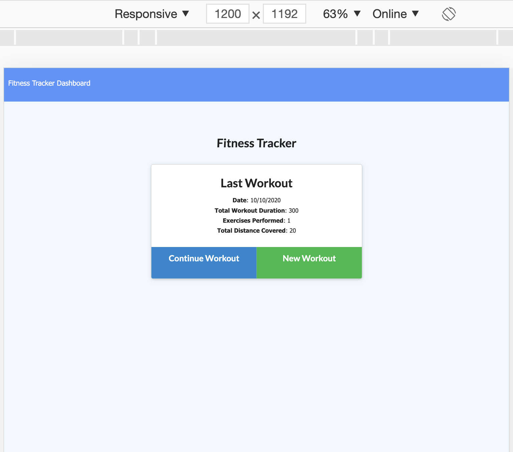

## The title of this project is Readme Generator.
        
License - 

## Table of Contents 
* [Installation](#Installation-instructions) 
* [Usage](#Usage) 
* [License](#License)
* [Contributing](#Contributing)
* [Tests](#Tests)
* [Questions](#Questions)
* [ScreenShots](#ScreenShots)

### - Installation Instructions
    Download code, run index.html if web based, run npm install, then run node index.js if node based.

### - Usage
    Use this program to generate a well formatted readme for your project.  There will be several standard sections and a table of contents.

### - License
    The license used for this project is the MIT license.

### - Contributing
    To suggest improvements email <mmink@michaelamink.com> or log an issue under the specific project in the GitHub repo - 
[GitHub](https://github.com/cermqm)

### - Tests
    Test this project by running node index.js and answering the prompts.  You will then review the readme.md and determine if it meets your needs.

### - Questions
    For questions contact Michael A. Mink at the following email -

<mmink@michaelamink.com>

    You can also log an issue under the specific project on GitHub - 

[GitHub](https://github.com/cermqm)

## The title of this project is Fitness Tracker.
        
License - 

## Table of Contents 
* [Installation](#Installation-instructions) 
* [Usage](#Usage) 
* [License](#License)
* [Contributing](#Contributing)
* [Tests](#Tests)
* [Questions](Questions)

### - Installation Instructions
    Download code, run index.html if web based, run npm install, then run node index.js if node based.

### - Usage
    Used to track workouts and progress.

### - License
    The license used for this project is the MIT license.

### - Contributing
    To suggest improvements email <mmink@michaelamink.com> or log an issue under the specific project in the GitHub repo - 
[GitHub](https://github.com/cermqm)

### - Tests
    Test adding and continuing workouts.  Also check functionality of dashboard.

### - Questions
    For questions contact Michael A. Mink at the following email -

<mmink@michaelamink.com>

    You can also log an issue under the specific project on GitHub - 

[GitHub](https://github.com/cermqm)

### - ScreenShots

